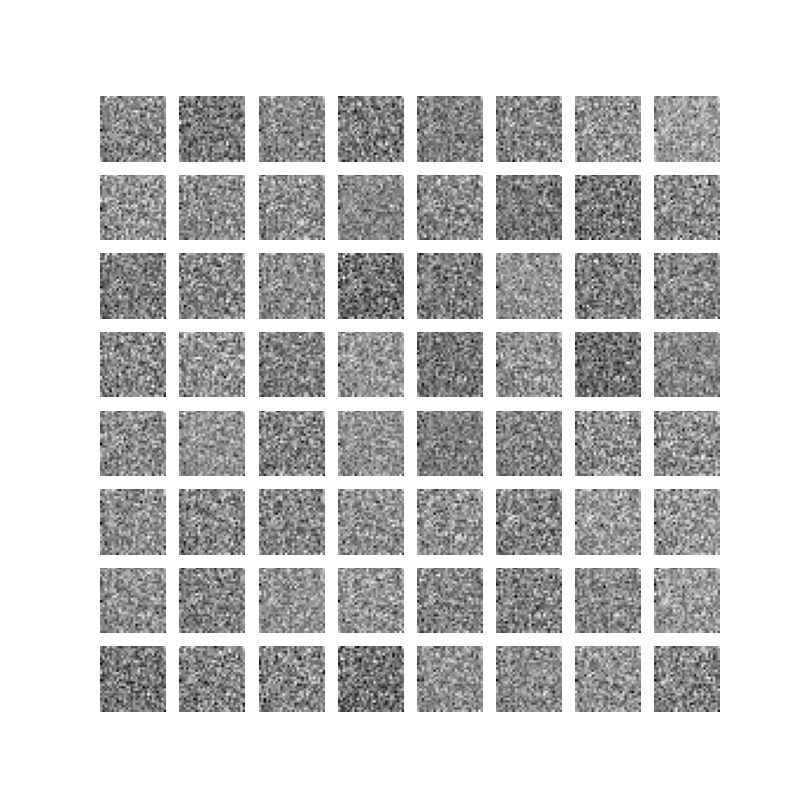
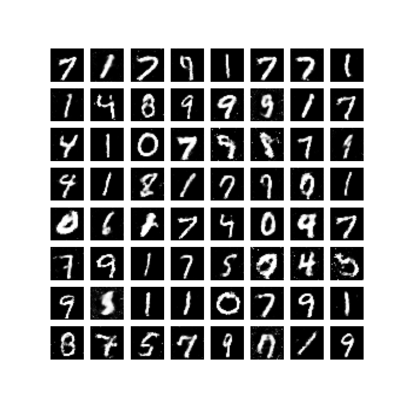
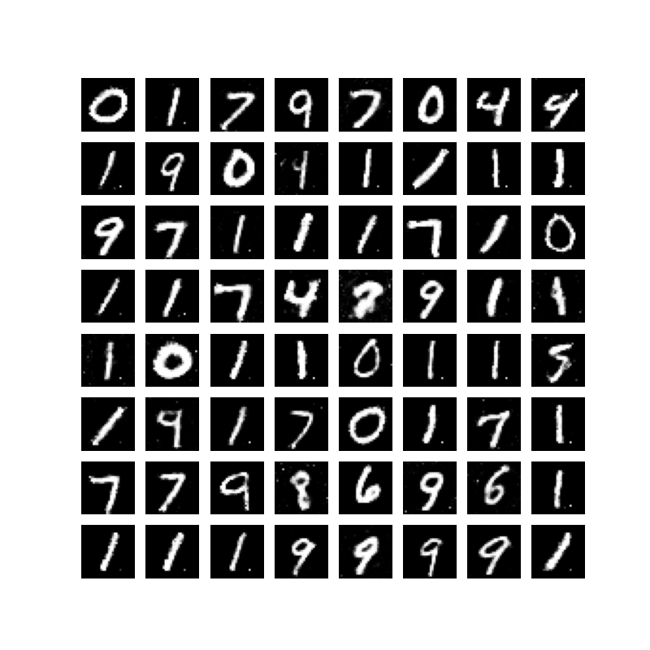
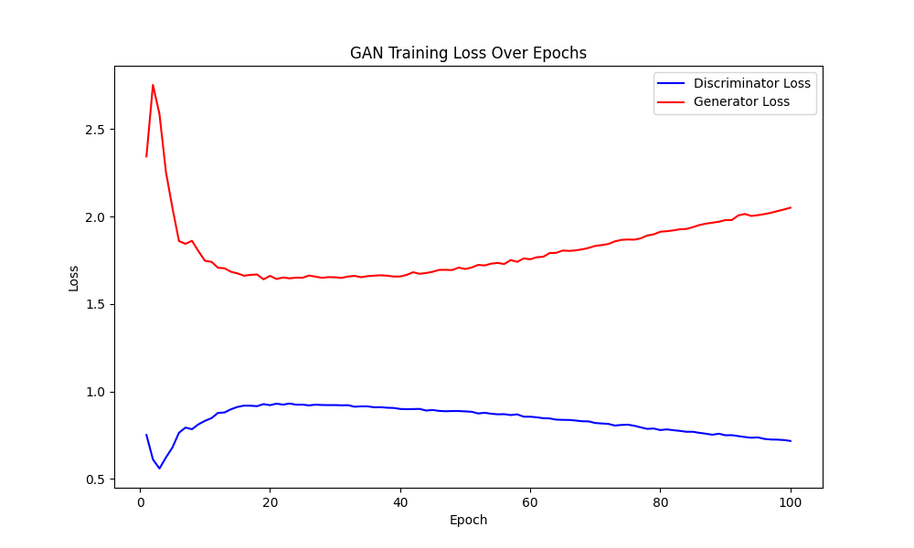

# GAN MNIST Handwritten Digit Generation

English  /  [中文](readme_zh.md)

↑ 点击切换语言

This project builds a simple **GAN (Generative Adversarial Network)** model to train on the **MNIST** handwritten digit dataset, enabling the model to generate realistic handwritten digit images from random noise.

The following three images show the generated images before training, at the 50th epoch, and at the 90th epoch, respectively.

**Before Training**



**50th Epoch**



**90th Epoch**



The following figure shows the trend of **Discriminator Loss** and **Generator Loss** during the training process.



## Table of Contents

- [Multi-language Comments](#multi-language-comments)
- [Dataset](#dataset)
- [File Structure](#file-structure)
- [Contributions](#contributions)

## Multi-language Comments

To make the code more understandable to developers with different language backgrounds, this project provides comments in both English and Chinese.

## Dataset

The dataset used in this project is the **MNIST** dataset, a classic handwritten digit dataset widely used for training and testing machine learning and deep learning models.

The MNIST dataset can be downloaded as follows:

- [MNIST](http://yann.lecun.com/exdb/mnist/)
- Directly load the MNIST dataset via commonly used deep learning frameworks.

In this project, the `datasets` module provided by `torchvision` is used to directly load the MNIST dataset.

## File Structure

The file structure of the project is as follows:

```c++
MNIST_Generation/
│
├── data/ 
│   └── MNIST
├── model/
│   ├── discriminator.pt
│   └── generator.pt
├── utils(en/zh)/
│   ├── images/
│   ├── __init__.py
│   ├── GAN.py
│   ├── loss_plot.ipynb
│   └── train.py
└── main.py 
```

## Contributions

All forms of contributions are welcome! Whether it's reporting bugs or providing suggestions, your input is greatly appreciated!
