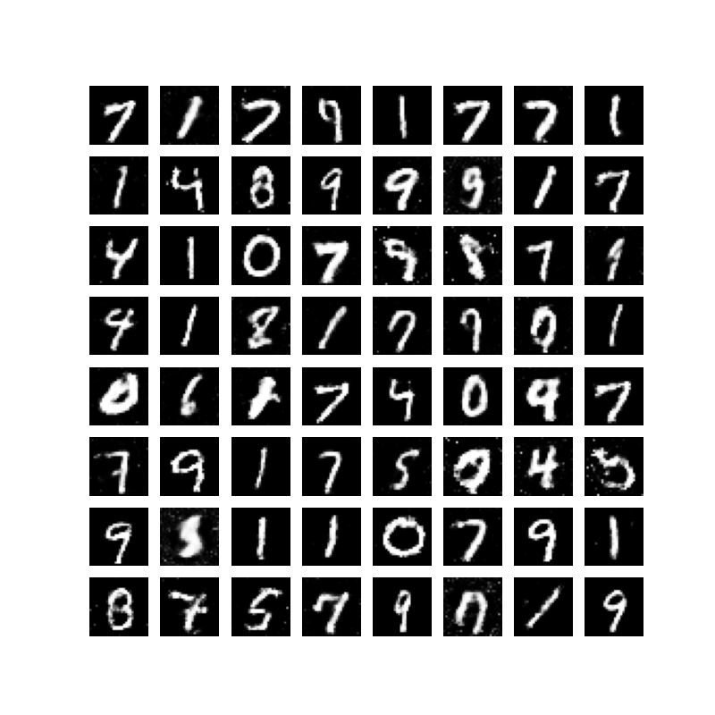
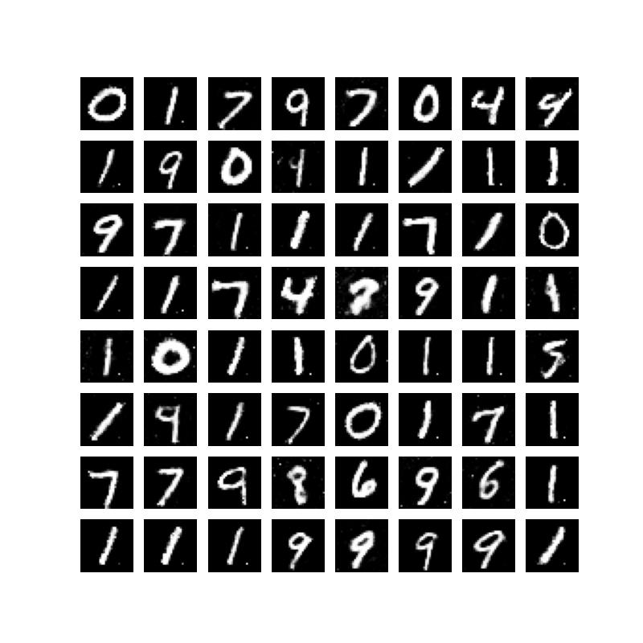

# GAN MNIST手写数字生成

[English](readme.md)  /  中文

↑ Click to switch language

本项目构建了一个简单的 **GAN ( 生成对抗网络 )** 模型 对 **MNIST** 手写数字数据集进行训练 使得模型能够从随机噪声中生成逼真的手写数字图像

以下三张图片分别展示了训练开始前 第50轮 和第90轮时生成的图像

**开始前**


**第50轮**



**第90轮**



下图展示了该模型在训练过程中的 **判别器损失 ( Discriminator Loss )** 和 **生成器损失 ( Generator Loss )** 的变化趋势


## 目录

- [多语言注释](#多语言注释)
- [数据集](#数据集)
- [文件结构](#文件结构)
- [贡献](#贡献)

## 多语言注释

为了让不同语言背景的开发者更容易理解代码 本项目的注释提供了英文和中文两种版本

## 数据集

本项目使用的数据集为 **MNIST** 数据集 这是一个非常经典的手写数字数据集 广泛用于机器学习和深度学习模型的训练和测试

MNIST 数据集可以通过以下方式下载

- [MNIST](http://yann.lecun.com/exdb/mnist/)
- 通过常用的深度学习框架直接加载 MNIST 数据集

在本项目中使用了 `torchvision` 提供的 `datasets` 模块直接加载 MNIST 数据集

## 文件结构

项目的文件结构如下

```c++
MNIST_Generation/
│
├── data/ 
│   └── MNIST
├── model/
│   ├── discriminator.pt
│   └── generator.pt
├── utils(en/zh)/
│   ├── images/
│   ├── __init__.py
│   ├── GAN.py
│   ├── loss_plot.ipynb
│   └── train.py
└── main.py 
```

## 贡献

欢迎所有形式的贡献！无论是报告错误还是提出建议 非常感谢！！